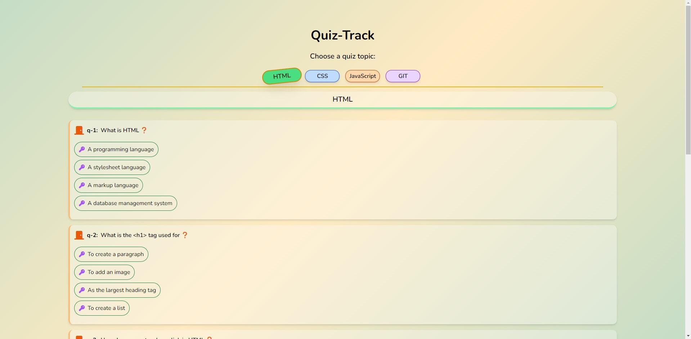
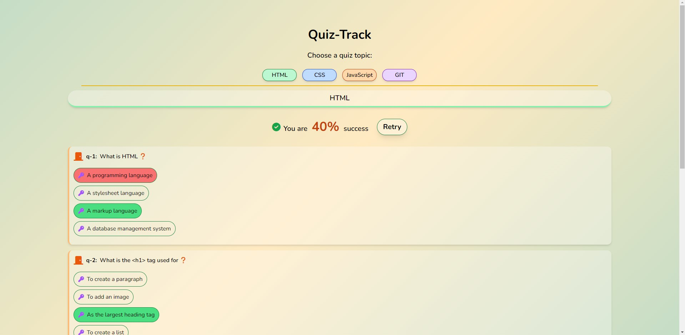
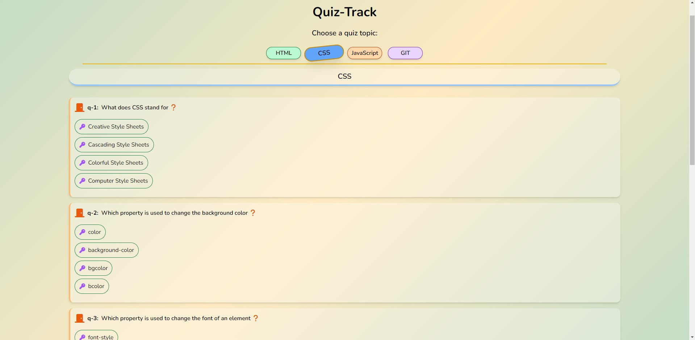
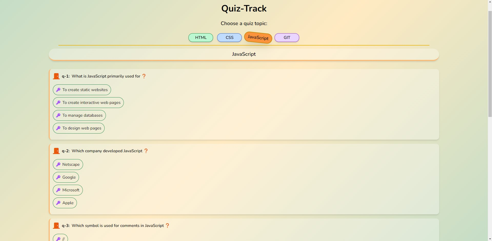

# Quiz Track Application

Welcome to the Quiz Track Application! This is a simple quiz application built with HTML, CSS, and JavaScript that lets users test their knowledge on various topics. The application fetches quiz questions from a JSON file and provides an interactive interface to select answers and view results.


## Features

- **Topic Selection**: Choose from four quiz topics: HTML, CSS, JavaScript, and Git.
- **Interactive Quiz**: Answer multiple-choice questions with instant feedback.
- **Result Display**: View your score and correct/incorrect answers after completing the quiz.
- **Retry Option**: Retry the quiz for the selected topic to improve your score.

## Installation

To set up the application locally, follow these steps:

1. **Clone the Repository:**
   ```bash
   git clone https://github.com/furrkanntas/05_QuizApp-QuizTrack.git

2. **Navigate to the Project Directory:**
   ```bash
   cd <project-directory>

3.  **Open `index.html` in Your Browser:**
- Open the index.html file in your web browser to start using the application.

## Project Structure

- **`index.html`:** The main HTML file that contains the structure of the application.
- **`app.js`:** The JavaScript file that handles quiz logic, including fetching data, displaying questions, and calculating results.
- **`question.js`:** Contains the Question class used to create and manage quiz questions.
- **`questions.json`:** JSON file containing the quiz questions and answers for different topics.
- **`styles.css`:** Custom CSS file to style the application.

## How It Works

1) <u>**Loading Data:**</u>
- The application fetches quiz data from questions.json and initializes the quiz topics.

2) <u>**Displaying Questions:**</u>
- When a topic is selected, the corresponding questions are loaded and displayed.

3) <u>**Selecting Answers:**</u>
- Users can click on options to select their answers. The selected answer is highlighted.

4) <u>**Submitting the Quiz:**</u>
- After completing the quiz, the score is calculated, and correct/incorrect answers are highlighted.

5) <u>**Viewing Results:**</u>
- Users can view their score and retry the quiz if desired.

## Screenshots








## GIFs


## Contributing
If you would like to contribute to the project, please fork the repository and submit a pull request with your changes. Feel free to open issues for any bugs or feature requests.

## License

This project is licensed under the MIT License - see the [LICENSE](LICENSE) file for details.

## Conclusion
Thank you for checking out the Quiz Track Application! We hope this tool helps you test and improve your knowledge. If you have any questions or suggestions, feel free to open an issue or contribute to the project. Your feedback is greatly appreciated!

Happy quizzing!

Best regards,  
Furkan Taş